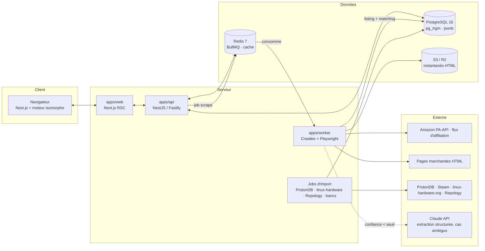
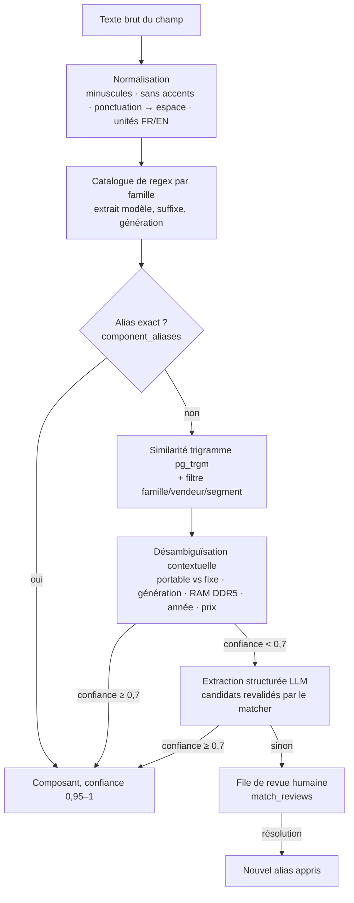

# 01 — Stack technique

> Outil web d'analyse, de diagnostic virtuel et de comparaison de PC (fixes et portables), où **Linux est
> traité au même niveau que Windows** : compatibilité matérielle, distributions, performances natives et
> via Proton. Ce document fixe la stack, l'architecture et le découpage en modules. Le schéma de données est
> dans [02-base-de-donnees.md](./02-base-de-donnees.md), les algorithmes dans [03-algorithmes.md](./03-algorithmes.md).

## 0. Résumé de la stack

| Couche | Choix | Pourquoi |
|---|---|---|
| **Frontend** | Next.js 15 (App Router, React Server Components) · React 19 · TypeScript strict · Tailwind CSS 4 · shadcn/ui · Recharts · TanStack Query · Zustand · next-themes | Rendu serveur + streaming pour des fiches instantanées, composants accessibles, mode sombre par défaut, graphiques FPS, panier de comparaison persistant |
| **Moteur** | `@pc-analyzer/engine` — TypeScript pur, sans I/O, **isomorphe** | Le même code calcule côté API (résultats mis en cache) et côté navigateur (changer résolution/preset/OS sans aller-retour serveur) |
| **API** | NestJS 11 sur adaptateur Fastify · Zod (schémas partagés avec le front) · OpenAPI · SSE pour la progression des jobs | Modules explicites (scraping, matching, diagnostic, linux, comparaison, performance), injection de dépendances, documentation auto |
| **Scraping** | Crawlee + Playwright (Chromium) · Cheerio pour le HTML statique · `fingerprint-suite` · proxies résidentiels (optionnels) · BullMQ | Un adaptateur par marchand, file d'attente, retries, cache ; le navigateur n'est utilisé que quand l'API ou le HTML statique ne suffisent pas |
| **Matching** | Catalogue de regex + table d'alias + similarité trigramme (`pg_trgm`) · extraction structurée par LLM en dernier recours (Claude API) · file de revue humaine | Déterministe d'abord, probabiliste ensuite, humain enfin ; chaque rapprochement porte une confiance et une provenance |
| **Base de données** | PostgreSQL 16 (`pg_trgm`, `jsonb`, énumérations) · Drizzle ORM (migrations SQL versionnées) | Référentiel composants + critères Linux, produits, jeux, exploitation — voir le doc 02 |
| **Cache / files** | Redis 7 (BullMQ, cache des fiches, limitation de débit) | Jobs asynchrones de scraping et d'import, résultats chauds |
| **Stockage objet** | S3 / Cloudflare R2 | Instantanés HTML des fiches (re-parsing sans re-scraping), images produit |
| **Recherche** | `pg_trgm` (suffisant au départ) · Meilisearch (optionnel, autocomplétion composants/PC) | Recherche « à la frappe » tolérante aux fautes |
| **Import de données** | Jobs planifiés BullMQ (repeatable) | ProtonDB, linux-hardware.org, Repology (versions noyau/Mesa par distribution), bancs publics |
| **Infra** | Docker Compose (dev/prod) · GitHub Actions · OpenTelemetry + pino · Sentry | Reproductible, observable |
| **Gestion du monorepo** | Workspaces npm (ici) — pnpm + Turborepo recommandés dès que `apps/` existe | Un seul dépôt : moteur, schéma, API, web, worker |

Le squelette livré dans ce dépôt contient le **moteur** (testé), le **schéma PostgreSQL** (validé) et la
**documentation** ; `apps/web`, `apps/api` et `apps/worker` sont décrits ici et restent à créer.

## 1. Principes d'architecture

1. **Linux au même niveau que Windows, partout.** Chaque écran qui parle de performance ou de compatibilité
   a deux colonnes. Le badge Linux (vert / orange / rouge) est calculé par composant *et* par distribution :
   « compatible » ne veut rien dire sans préciser le noyau livré.
2. **Données mesurées avant modèle.** Une mesure (banc FPS, sonde linux-hardware.org, rapport ProtonDB)
   l'emporte toujours sur un coefficient. Les coefficients existent pour interpoler là où il n'y a pas de mesure,
   et sont recalibrés par régression sur les mesures accumulées.
3. **Moteur pur et isomorphe.** `@pc-analyzer/engine` ne connaît ni la base ni le réseau : il prend des
   structures typées et rend des rapports. Il tourne dans l'API (résultats cachés dans `pc_analyses`) et dans
   le navigateur (comparateur instantané). Ses tests ne demandent aucune infrastructure.
4. **Provenance et confiance.** Chaque composant rapproché, chaque statut Linux, chaque FPS porte une
   confiance (0–1) et une source. L'interface affiche la confiance, jamais un chiffre nu.
5. **Scraping sobre et légal d'abord.** APIs et flux d'affiliation avant le HTML, HTML statique avant le
   navigateur, cache avant tout ; l'utilisateur peut toujours coller le texte de la fiche si la récupération
   échoue.

## 2. Architecture



**Parcours utilisateur** : l'utilisateur colle une URL ou une référence → l'API crée un `scrape_job`
(réponse immédiate avec `jobId`) → le worker récupère la fiche (API/flux, HTML, ou navigateur), archive
l'instantané, extrait les paires clé/valeur, rapproche chaque composant du référentiel → la fiche `pcs`
est créée ou réutilisée (dédoublonnage par marque/modèle/SKU) → l'API calcule ou relit l'analyse
(`pc_analyses`) → le navigateur reçoit la progression par SSE puis la fiche complète. Une fiche déjà
connue se sert directement du cache : réponse en dizaines de millisecondes.

## 3. Arborescence cible du monorepo

```
pc-analyzer/
├── apps/
│   ├── web/                 Next.js — pages : /analyser, /pc/[id], /comparer, /jeux, /linux/[distro]
│   ├── api/                 NestJS — modules : scraping, matching, diagnostic, linux, comparison, performance, admin
│   └── worker/              Crawlee — adaptateurs marchands, pipeline d'extraction, jobs d'import
├── packages/
│   ├── engine/              ✅ moteur pur (compatibilité Linux, distributions, FPS, charges pro) + tests
│   ├── db/                  ✅ migrations SQL, seed de référence, script de vérification (PGlite)
│   ├── shared/              schémas Zod des DTO, types d'API générés depuis OpenAPI
│   └── ui/                  composants partagés (badges Linux, graphiques FPS, tableau comparatif)
├── docs/                    ✅ 01 stack · 02 base de données · 03 algorithmes
├── docker-compose.yml       postgres · redis · meilisearch (opt.) · api · web · worker
└── package.json             workspaces
```

## 4. Module 1 — Scraping et analyse de référence

### 4.1 Stratégie par marchand (du plus sûr au plus fragile)

| Niveau | Source | Marchands | Remarques |
|---|---|---|---|
| 1 | **API officielle** | Amazon *Product Advertising API 5.0* (`GetItems` par ASIN : `ItemInfo.TechnicalInfo`, `ProductInfo`, prix, images) | Nécessite un compte Partenaires actif ; seule voie conforme aux conditions d'Amazon |
| 2 | **Flux d'affiliation** | Fnac, Darty, Boulanger, Cdiscount, LDLC… via les plateformes d'affiliation (Awin, Effiliation, Kwanko selon le marchand) | Flux CSV/XML quotidiens avec référence, titre, caractéristiques, prix, disponibilité ; légal et stable |
| 3 | **Données structurées de la page** | JSON-LD `schema.org/Product`, balises Open Graph, microdonnées | Présentes sur la plupart des fiches ; Cheerio suffit (pas de navigateur) |
| 4 | **HTML statique** | Tableaux « Caractéristiques techniques », puces, titre | Sélecteurs par adaptateur, testés sur des instantanés archivés |
| 5 | **Navigateur headless** | Crawlee + Playwright, empreintes réalistes, proxies résidentiels | Réservé aux pages rendues en JavaScript ; coûteux, fragile face aux anti-bots (Akamai, DataDome…) ; derrière un *feature flag* |
| 6 | **Texte collé par l'utilisateur** | Formulaire « collez la fiche technique » | Contourne tout blocage : le pipeline d'extraction est le même |

Règles communes : respect de `robots.txt` et des conditions d'utilisation, 1 requête toutes les 2 à 5 s
par domaine, cache des fiches 24 h (Redis) + instantané HTML permanent (S3), *User-Agent* identifiable là où
c'est accepté, aucun contournement d'authentification. Le mode navigateur n'est jamais activé par défaut en
production sans validation juridique.

### 4.2 Adaptateurs

Un adaptateur par marchand implémente une interface unique :

```ts
interface RetailerAdapter {
  retailer: Retailer;
  matches(input: string): boolean;                 // URL ou référence reconnue ?
  externalId(input: string): string;               // ASIN, référence Fnac, code Boulanger…
  fetch(id: string): Promise<RawListing>;          // niveaux 1 → 5, dans l'ordre
  extract(raw: RawListing): ExtractedSpecs;        // paires clé/valeur normalisées
}
```

`ExtractedSpecs` est un objet plat (`cpu`, `gpu`, `ram`, `storage`, `display`, `wifi`, `os`, `price`,
`repairability_index`…) avec, pour chaque champ, le texte brut et son origine (titre, puce, tableau, JSON-LD).
L'**indice de réparabilité** français, affiché obligatoirement par les marchands, est extrait tel quel.

### 4.3 Pipeline de matching (description marchande → composant réel)



Extraits du catalogue de regex (illustration, le catalogue vit dans `apps/worker/src/matching/patterns.ts`) :

```ts
const PATTERNS = {
  intelCore:   /\b(?:core\s*)?(i[3579])[\s-]*(\d{4,5})([a-z]{0,2})\b/i,          // i7-13700H, i5 1235U
  intelUltra:  /\bcore\s*ultra\s*([579])\s*(\d{3})([a-z]?)\b/i,                   // Core Ultra 7 155H
  amdRyzen:    /\bryzen\s*(?:ai\s*)?([3579])\s*(?:pro\s*)?(hx\s*)?(\d{3,4})\s*(x3d|hx|hs|x|u|h)?\b/i,
  appleM:      /\b(m[1-4])\s*(pro|max|ultra)?\b/i,
  nvidia:      /\b(?:geforce\s*)?(rtx|gtx)\s*(\d{3,4})\s*(ti|super)?\s*(laptop|mobile|max-q)?/i,
  radeon:      /\bradeon\s*(rx\s*)?(\d{3,4}m?)\s*(xtx|xt|gre)?\b/i,               // RX 7800 XT, 780M
  intelArc:    /\barc\s*(?:graphics\s*)?([ab])?(\d{3})[mv]?\b/i,                   // Arc A770, Arc 140V
  ram:         /(\d{1,3})\s*(?:go|gb)\b(?:[^.]{0,20}?(ddr[345]|lpddr[45]x?))?/i,
  storage:     /(\d{3,4})\s*(go|gb|to|tb)\s*(ssd|nvme|hdd|emmc)?/i,
  display:     /(\d{2}[.,]\d)\s*(?:pouces|"|”)|(\d{3,4})\s*[x×]\s*(\d{3,4})|(\d{2,3})\s*hz/gi,
  wifiChip:    /\b(ax2\d{2}|be20[01]|mt79\d{2}|rz6\d{2}|rtl8\d{3}[a-z]{2}|bcm4\d{3}|wcn\d{4}|qca\d{4})\b/i,
};
```

Désambiguïsation typique : « Intel Core i7 » sans numéro → candidats par génération, départagés par le
contexte (« 13e génération », « Raptor Lake », DDR5, année de sortie, gamme de prix). Une fiche de portable
qui dit « RTX 4060 » désigne la **RTX 4060 Laptop** (indice de perf et TGP différents). Un GPU de portable
sans TGP annoncé est marqué `tgp_w = NULL` : le moteur prend le milieu de la plage et baisse la confiance.

**Extraction par LLM (dernier recours automatique).** Quand la confiance déterministe reste < 0,7, le
worker envoie titre + puces + tableau à l'API Claude (modèle `claude-opus-5`, sorties structurées via
`output_config.format` avec un schéma JSON strict : `cpu`, `gpu`, `ram_gb`, `storage`, `display`, `wifi`,
`confidence`). Les valeurs renvoyées sont **revalidées par le matcher déterministe** (jamais insérées telles
quelles), le préfixe d'instructions fixe est mis en cache (`cache_control`), et le résultat est mémorisé par
hachage de la fiche. Coût borné : quelques pour cent des fiches, une fois chacune.

**Apprentissage.** Chaque revue humaine crée un alias (`component_aliases`, `source = 'review'`) : le même
libellé est reconnu instantanément la fois suivante.

## 5. Module 2 — Diagnostic virtuel et compatibilité

Le diagnostic est calculé par le moteur à partir de la fiche `pcs` + `pc_components` :

- **Forces / faiblesses** : règles sur les indices (CPU/GPU équilibrés ?), la RAM (8 Go, simple canal,
  soudée), le stockage (SATA vs NVMe, capacité), l'écran (60 Hz, TN, faible couverture sRGB), la
  batterie (Wh vs TDP), les ports (USB4/Thunderbolt, Ethernet), le rapport performance/prix vs médiane de
  la catégorie.
- **Réparabilité** (0–10) : indice de réparabilité français quand il est affiché, sinon score composé
  (RAM soudée, SSD remplaçable, batterie vissée, manuel disponible, pièces détachées, score iFixit).
- **Évolutivité** (0–10) : emplacements RAM et M.2 libres, RAM max, socket/plateforme (AM5, LGA1851),
  marge d'alimentation et longueur GPU (fixes), carte Wi-Fi sur M.2 remplaçable (portables).
- **Compatibilité Linux** : rapport par composant et par distribution — détail dans le doc 03 § 1.
  Détection des composants problématiques (Wi-Fi Realtek/Broadcom hors arbre, NVIDIA propriétaire vs
  Nouveau, Secure Boot et modules non signés, Intel VMD, caméras MIPI IPU6, amplis Cirrus, lecteurs
  d'empreintes), recommandation de distributions (doc 03 § 2), statut du noyau (`kernel_min`,
  `kernel_recommended`) comparé au noyau **réellement livré** par chaque distribution.

## 6. Module 3 — Comparaison avancée

- Jusqu'à **4 PC** côte à côte ; panier de comparaison en `localStorage` (Zustand persist), partage par
  `share_slug` (`comparisons`).
- `GET /api/compare?ids=a,b,c,d` renvoie une **matrice** : lignes = critères, colonnes = PC, chaque cellule
  = valeur + badge + meilleur de la ligne. Deux blocs : *Matériel* (CPU, GPU, RAM, stockage, écran, ports,
  réparabilité, évolutivité, prix, perf/prix) et *Comportement par OS* (Windows : pilotes fournis, mises à
  jour ; Linux : badge global, badge par composant, distributions recommandées, Secure Boot, FPS natif/Proton
  par jeu, outils pro).
- **Perf/prix en direct** : `(0,5·gpu + 0,3·cpu_jeu + 0,2·mémoire_stockage) / prix × 1000`, prix issu de
  la dernière ligne de `price_history` ; la médiane de la catégorie sert de référence.

## 7. Module 4 — Estimateur FPS et performances pro

Catalogue de jeux populaires (`games`), synthèse ProtonDB (`game_proton_status`), bancs (`game_benchmarks`).
Pour chaque jeu × résolution × preset, trois colonnes : **Windows**, **Linux natif** (si portage) et
**Linux via Proton**, avec palier ProtonDB (Platinum/Gold/Silver/Bronze/Borked), statut Steam Deck,
anti-cheat, chemin recommandé et confiance. Le modèle est détaillé dans le doc 03 § 3. Les charges pro
(montage vidéo, développement, rendu 3D, IA locale) donnent un score par OS avec les outils optimisés sous
Linux (Docker natif, Blender CUDA/OptiX ou HIP/ROCm, DaVinci Resolve, oneAPI…) — doc 03 § 4.

## 8. API (extrait)

| Méthode | Route | Rôle |
|---|---|---|
| `POST` | `/api/analyze` `{ input }` | Crée un job à partir d'une URL, d'une référence ou d'un texte collé → `{ jobId }` |
| `GET` | `/api/jobs/:id` · `/api/jobs/:id/events` (SSE) | État et progression (`queued → fetching → parsed → matched`) |
| `GET` | `/api/pcs/:id` | Fiche complète : composants, diagnostic, rapport Linux, FPS, charges pro |
| `GET` | `/api/pcs/:id/fps?games=&resolution=&preset=&os=&rt=&upscaling=` | Estimations à la demande (le navigateur peut aussi les calculer localement) |
| `GET` | `/api/pcs/:id/linux?distro=fedora-43&profile=gaming` | Rapport de compatibilité pour une distribution |
| `GET` | `/api/compare?ids=` | Matrice de comparaison (≤ 4 PC) · `POST /api/compare` crée un lien de partage |
| `GET` | `/api/games?search=` · `/api/components?search=` · `/api/distros` | Référentiels |
| `POST` | `/api/admin/reviews/:id` | Résolution d'une revue de matching (crée l'alias) |

Validation Zod à l'entrée, DTO partagés dans `packages/shared`, OpenAPI généré, limitation de débit par IP
(`@nestjs/throttler` + Redis), ETag/Cache-Control sur les fiches.

## 9. Frontend et UX

- **Sombre par défaut** (`next-themes`, `defaultTheme="dark"`), thème clair disponible ; palette contrôlée
  par un test de contraste WCAG AA.
- **Badges Linux** : vert *Plug & Play*, orange *Tweaks requis*, rouge *Incompatible*, gris *Données
  insuffisantes* — chaque badge est cliquable et déroule raisons + actions.
- **Graphiques** : barres groupées Windows / Linux natif / Proton par jeu (Recharts), avec la confiance en
  opacité et les 1 % low en repère ; jauges pour réparabilité et évolutivité.
- **Instantanéité** : fiches rendues côté serveur avec streaming ; le moteur tourne dans le navigateur pour
  les changements de résolution, preset, OS et upscaling ; ISR sur les fiches populaires.
- **Responsive** : comparateur en colonnes défilantes sur mobile (critères épinglés à gauche).
- **Accessibilité** : composants Radix (shadcn/ui), textes alternatifs des graphiques, navigation clavier.

## 10. Sécurité, conformité, exploitation

- Aucune donnée personnelle nécessaire : sessions anonymes, comparaisons partagées par slug avec expiration.
- Clés d'API (PA-API, affiliation, Claude, proxies) dans l'environnement, jamais en base.
- Journalisation structurée (pino) + traces OpenTelemetry (API, worker, requêtes SQL) ; alertes sur le taux
  d'échec des jobs par marchand (un adaptateur cassé se voit en minutes).
- CI : typecheck, lint, tests du moteur, `db:check` (schéma + seed rejoués dans PGlite), tests des
  adaptateurs sur instantanés archivés (jamais contre les sites en CI).
- Déploiement : Docker Compose (`web`, `api`, `worker`, `postgres`, `redis`), images distinctes ; le worker
  navigateur est dimensionné et isolé (mémoire, réseau sortant).

## 11. Feuille de route

| Phase | Contenu |
|---|---|
| 0 ✅ | Moteur (compatibilité Linux, distributions, FPS, charges pro) + schéma + docs |
| 1 | `apps/api` + `apps/web` sur le seed : fiche PC, rapport Linux, FPS, comparateur ; texte collé comme seule source |
| 2 | Worker : PA-API Amazon, flux d'affiliation, JSON-LD/HTML pour Fnac, Boulanger, Cdiscount, Darty, LDLC ; revue humaine |
| 3 | Imports : ProtonDB, linux-hardware.org (statuts par ID PCI), Repology (noyau/Mesa), bancs publics ; recalibration des coefficients |
| 4 | Comptes (optionnels), alertes prix, historique, API publique |
