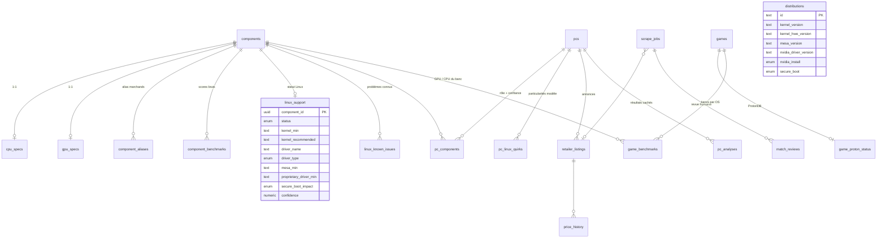

# 02 — Architecture de la base de données

> PostgreSQL 16. Migration : [`packages/db/migrations/0001_init.sql`](../packages/db/migrations/0001_init.sql) ·
> seed de référence : [`packages/db/seed/0001_reference_seed.sql`](../packages/db/seed/0001_reference_seed.sql) ·
> vérification : `npm run db:check` (rejoue migration + seed dans PGlite et teste le matching trigramme).

## 1. Principes

- **Colonnes typées pour ce que lit le moteur, `jsonb` pour le reste.** Les indices de performance, les
  versions de noyau, le statut Linux sont des colonnes ; les spécifications de détail (fréquences, ports,
  châssis) sont du `jsonb`. Le moteur (`packages/engine/src/types.ts`) est le miroir exact des énumérations
  et des colonnes typées.
- **Les versions sont du texte comparé numériquement** par l'application (`compareVersions` : `6.10 > 6.8`),
  jamais des nombres flottants.
- **Provenance partout** : `source`, `confidence`, `verified_at` sur les données de support Linux ;
  `match_method`, `match_confidence`, `raw_text` sur chaque composant rapproché ; `dataset_imports` pour
  chaque lot importé.
- **Instantanés figés** : un banc FPS enregistre l'indice du GPU *au moment de la mesure*
  (`gpu_perf_index_snapshot`) — recalibrer les indices ne déplace pas les mesures.
- **Deux niveaux pour Linux** : le support **par composant** (`linux_support`, réutilisable par toutes les
  machines qui l'embarquent) et les particularités **par modèle** (`pc_linux_quirks`, ex. firmware audio
  d'une gamme précise).

## 2. Modèle (ERD)



## 3. Domaine 1 — Référentiel

### `components`
Un composant canonique par ligne (`family`, `vendor`, `name`, `canonical_name` unique, `segment`,
`launch_date`, `device_ids` — IDs PCI/USB `vendor:device` pour croiser linux-hardware.org —, `specs jsonb`).
Index trigramme sur `canonical_name`.

### `cpu_specs` / `gpu_specs` (1-1)
Entrées typées du moteur :

| Colonne | Sens |
|---|---|
| `cpu_specs.gaming_index` | indice « jeu » (mono-cœur + cache), meilleur CPU de bureau grand public = 100 |
| `cpu_specs.multi_index` | indice multi-cœur, même échelle |
| `cpu_specs.has_npu` | NPU présent (pilotes `intel_vpu`, `amdxdna`) |
| `gpu_specs.perf_index` | indice de rastérisation, GeForce RTX 4090 de bureau = 100 (dérivé des scores 3DMark Time Spy importés dans `component_benchmarks`) |
| `gpu_specs.integrated`, `vram_gb` | iGPU (VRAM partagée) ou dédié |
| `gpu_specs.tgp_min_w`, `tgp_max_w` | plage de TGP des GPU de portable ; `perf_index` est mesuré au max |
| `gpu_specs.ray_tracing`, `rt_efficiency` | RT matériel et efficacité relative (NVIDIA même génération = 1) |
| `gpu_specs.upscalers`, `encoders`, `compute_apis`, `rocm_official` | DLSS/FSR/XeSS, NVENC/VCN/QSV, CUDA/ROCm/oneAPI, liste de support officielle ROCm |

### `component_aliases`
Toutes les écritures marchandes d'un composant : `alias`, `alias_normalized` (clé de matching),
`kind` (`marketing`, `retailer`, `oem`, `pci_id`, `codename`, `typo`), `source`, `confidence`.
Index GIN trigramme sur `alias_normalized` : requête `alias_normalized % 'geforce rtx 4060 8go laptop'`
→ « NVIDIA GeForce RTX 4060 Laptop » (similarité 0,63 dans le seed).

### `component_benchmarks`
Scores bruts importés (`benchmark` = `3dmark_timespy_graphics`, `passmark_cpu_single`,
`geekbench6_multi`…, `score`, `config jsonb` pour le TGP ou la version de pilote, `source_url`). Les
indices normalisés sont recalculés à partir de cette table.

### `linux_support` — les critères Linux

| Colonne | Valeurs | Rôle dans le calcul |
|---|---|---|
| `status` | `plug_and_play` (vert) · `tweaks_required` (orange) · `partial` (orange foncé) · `unsupported` (rouge) · `unknown` (gris) | Statut de base sur noyau récent |
| `kernel_min` | ex. `6.10` | Sous cette version : **non supporté** sur la distribution (sauf noyau HWE) |
| `kernel_recommended` | ex. `6.11` | Entre `kernel_min` et cette version : support jeune → orange |
| `driver_name`, `driver_type` | `in_tree`, `in_tree_firmware`, `dkms`, `proprietary`, `none` | Explique le statut ; `dkms`/`proprietary` déclenchent des actions |
| `firmware_package` | `linux-firmware`, `sof-firmware`… | Information (fourni par la plupart des distributions) |
| `mesa_min` | GPU : version Mesa minimale (RADV/ANV/NVK) | Comparée à `distributions.mesa_version` |
| `proprietary_driver_min` | NVIDIA : `570` pour Blackwell… | Comparée à `distributions.nvidia_driver_version` |
| `secure_boot_impact` | `none`, `mok_enrollment`, `must_disable` | Actions Secure Boot si la machine l'active par défaut |
| `confidence`, `probe_count`, `source_url`, `verified_at` | | Qualité de la donnée (sondes linux-hardware.org, changelog noyau, Arch Wiki, vérification manuelle) |

### `linux_known_issues`
Problèmes connus par composant : `summary`, `severity` (`minor`, `major`, `blocking`), `workaround`,
`fixed_in_kernel` (le problème disparaît du rapport quand le noyau retenu l'atteint), `source_url`.

### `distributions`
Ce que chaque distribution **livre** : `kernel_version`, `kernel_hwe_version` (Ubuntu HWE, noyau
alternatif officiel), `rolling`, `lts`, `mesa_version`, `nvidia_driver_version`, `nvidia_install`
(`bundled` = image avec pilote, `easy`, `manual`, `none`), `secure_boot` (`out_of_the_box`, `mok`,
`unsupported`), `audience[]` (`beginner`, `gaming`, `developer`, `workstation`, `enthusiast`),
`release_date`, `eol_date`. Rafraîchie par job (§ 6).

## 4. Domaine 2 — Produits

### `pcs`
Configuration : `kind`, `brand`, `model_name`, `sku`, mémoire typée (`ram_total_gb`, `ram_type`,
`ram_speed_mt`, `ram_channels`, `ram_soldered`, `ram_slots_free`, `ram_max_gb`), `storage jsonb`
(liste), `display jsonb`, `chassis jsonb`, `ports jsonb`, `battery_wh`, `psu_w`, firmware
(`secure_boot_default`, `intel_vmd_raid_default`, `tpm`), `linux_vendor_certified[]`
(`ubuntu-certified`, `linux-first-oem`…), `repairability jsonb` (indice français, iFixit, manuel,
pièces). Unicité `(brand, model_name, sku)` pour dédoublonner les annonces de plusieurs marchands.

### `pc_components`
`(pc_id, role, component_id)` avec `quantity`, `tgp_w` (GPU de portable), et la **provenance du
rapprochement** : `match_method` (`alias_exact`, `regex`, `fuzzy`, `llm`, `manual`), `match_confidence`,
`raw_text` (ce que disait le marchand). Un GPU peut apparaître en `gpu_integrated` et un autre en
`gpu_discrete` (graphismes hybrides).

### `pc_linux_quirks`
Particularités au niveau d'un modèle ou d'une gamme : soit `pc_id`, soit `(brand, model_pattern)`
regex (« Lenovo / `^Legion (5|7)` : pas de son sans firmware CS35L41 récent »). Fusionnées dans le
rapport Linux avec les problèmes par composant.

### `retailer_listings`, `price_history`
Annonce marchande (`retailer`, `external_id` — ASIN, référence Fnac… —, `url`, `title`,
`raw_specs jsonb`, prix, stock, `repairability_index`, `html_snapshot_key` vers l'instantané S3,
`pc_id` une fois rapprochée) et son historique de prix (perf/prix en direct, futures alertes).

## 5. Domaine 3 — Jeux

### `games`
`apis[]` (la première est l'API par défaut : `dx12` → VKD3D-Proton, `dx11` → DXVK…), portage natif
(`linux_native`, `linux_native_api`, `linux_native_perf_ratio` mesuré vs Windows), anti-cheat
(`anti_cheat_kind`, `anti_cheat_linux` = `supported` / `blocked` / `unknown`), exigences (`min_ram_gb`,
`rec_ram_gb`, `vram_gb jsonb` par preset à 1080p), `cpu_bound_fps_ref` (plafond CPU sur un CPU d'indice
100, calibré sur les bancs), `fps_cap` (plafond moteur), ray tracing (`ray_tracing`, `ray_tracing_cost`),
`upscalers[]`, `popularity_rank`.

### `game_proton_status`
Synthèse ProtonDB : `tier` (`platinum`… `borked`, `pending`), `confidence`, `reports`, `trending_tier`,
`score`, `steam_deck` (`verified`, `playable`, `unsupported`), `fetched_at`.

### `game_benchmarks`
Une mesure = un jeu × `os` (`windows`, `linux_native`, `linux_proton`) × GPU (+ CPU) × `resolution` ×
`preset` × `ray_tracing` × `upscaling` (+ `proton_version`, `tgp_w`) → `avg_fps`, `low_1pct_fps`,
`source_type` (`review_site`, `phoronix`, `user_report`, `computed`, `manual`), `source_url`,
`measured_at`, `sample_size`, `confidence`. Index `(game_id, os, resolution, preset)`.

## 6. Domaine 4 — Exploitation

| Table | Rôle |
|---|---|
| `scrape_jobs` | file des analyses demandées (`queued → fetching → parsed → matched` / `needs_review` / `failed`), tentatives, erreur, liens vers l'annonce et le PC |
| `match_reviews` | composants que le matching n'a pas tranchés : texte brut, candidats `jsonb` avec confiance, résolution humaine (crée un alias) |
| `comparisons` | comparaisons partagées : `share_slug`, `pc_ids[]` (contrainte **1 à 4**), options (`os_focus`, jeux, résolution, preset), expiration |
| `pc_analyses` | résultats du moteur mis en cache par `(pc_id, engine_version, dataset_version)` : rapport Linux, diagnostic, FPS, charges pro |
| `dataset_imports` | provenance des lots importés (ProtonDB du jour X, bancs de tel site, sondes linux-hardware) |

### Sources de données et jobs de rafraîchissement

| Jeu de données | Source | Fréquence | Tables alimentées |
|---|---|---|---|
| Synthèses ProtonDB | résumés publics ProtonDB par `steam_app_id` | quotidienne | `game_proton_status` |
| Statut Steam Deck | Steam (rapport de compatibilité Deck par AppID) | hebdomadaire | `game_proton_status.steam_deck` |
| Support matériel | sondes publiques linux-hardware.org par ID PCI/USB (statuts « works / works with tweaks / fails ») + changelogs noyau + Arch Wiki | hebdomadaire (auto) + revue manuelle | `linux_support`, `linux_known_issues` |
| Versions livrées par distribution | API Repology (paquets `linux`, `mesa`, `nvidia`) + endoflife.date (cycles de vie) | quotidienne | `distributions` |
| Bancs FPS | sites de tests (Windows), Phoronix et rapports communautaires (Linux) — import manuel ou semi-automatique avec `source_url` | à chaque nouvelle génération de GPU | `game_benchmarks` |
| Scores composants | PassMark, Geekbench, 3DMark (données publiques, conditions d'usage à vérifier) | mensuelle | `component_benchmarks` → recalcul des indices |
| Fiches marchandes | PA-API Amazon, flux d'affiliation, pages | à la demande + rafraîchissement des prix | `retailer_listings`, `price_history` |

Chaque import écrit une ligne dans `dataset_imports` ; la `dataset_version` composée (`protondb:2026-09-01
+ benchmarks:v12`) invalide le cache `pc_analyses`.

## 7. Requêtes types

```sql
-- Matching : candidats pour un libellé normalisé, famille connue.
SELECT c.id, c.name, similarity(a.alias_normalized, $1) AS sim
  FROM component_aliases a JOIN components c ON c.id = a.component_id
 WHERE c.family = $2 AND a.alias_normalized % $1
 ORDER BY sim DESC LIMIT 5;

-- Chargement d'une configuration pour le moteur (vue components_with_linux).
SELECT pc.role, pc.tgp_w, pc.match_confidence, v.*
  FROM pc_components pc JOIN components_with_linux v ON v.id = pc.component_id
 WHERE pc.pc_id = $1;

-- Composants dont le noyau minimal dépasse le noyau GA d'une distribution (pré-filtre SQL,
-- la comparaison numérique fine est faite par le moteur).
SELECT c.name, ls.kernel_min FROM linux_support ls JOIN components c ON c.id = ls.component_id
 WHERE ls.kernel_min IS NOT NULL
   AND string_to_array(ls.kernel_min, '.')::int[] > string_to_array($1, '.')::int[];

-- Bancs disponibles pour un jeu, un OS et une cible.
SELECT * FROM game_benchmarks
 WHERE game_id = $1 AND os = $2 AND resolution = $3 AND preset = $4 AND NOT ray_tracing AND upscaling = 'none';
```

## 8. Évolutions prévues

- `pgvector` : embeddings des titres marchands pour un rappel sémantique avant le trigramme (fiches
  multilingues, abréviations exotiques).
- Partitionnement de `price_history` par mois quand les alertes prix arriveront.
- Table `users` (optionnelle) pour sauvegarder comparaisons et alertes ; aucune donnée personnelle n'est
  requise par le cœur du produit.
